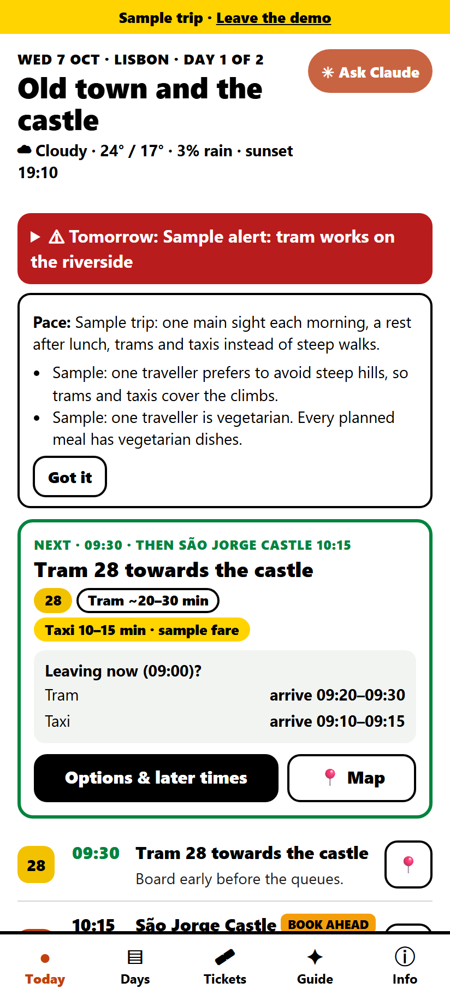
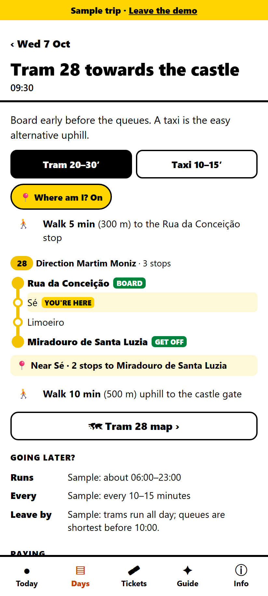
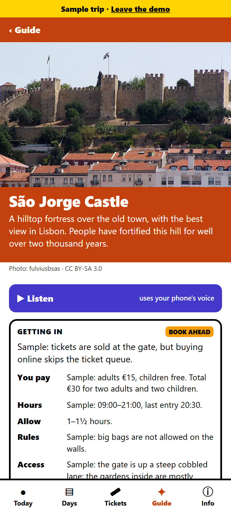
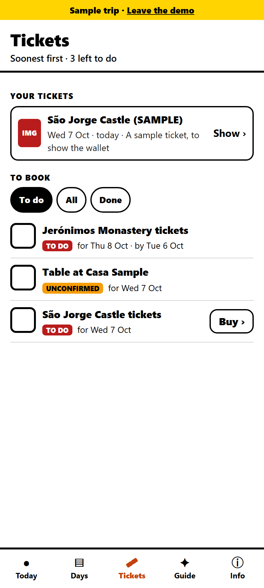
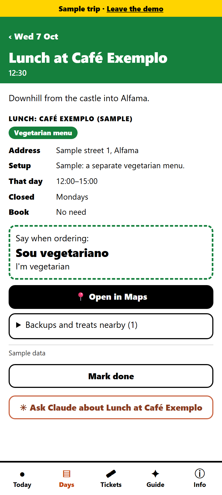

# Fieldbook

**An offline, encrypted trip companion. It turns an itinerary file into a phone app that works without signal.**

[Try the live demo](https://arash009.github.io/fieldbook/#demo) (a sample weekend in Lisbon; it starts today, so "next" and "leaving now?" are live).

<p>
  
  
  
  
  
</p>

## Why
A family trip plan ends up scattered across chats, documents and booking emails. On the road there's roaming data, patchy signal and no time to dig. When someone in the group has limited mobility or a strict diet, the details matter: which metro exit has a lift, whether the restaurant has a separate kitchen, what time the last train goes.

Fieldbook puts the plan in one place that opens instantly and keeps working offline.

## What it does
- **Today**: opens on the current day in the *trip's* time zone, even if the phone hasn't switched. It shows the next stop and an estimate for every way of getting there. Arrival windows are flagged when you'd miss the following stop, and an option is marked when it isn't running.
- **Transport options and later times**: metro, tram and taxi side by side, step by step, with running hours, frequency, the latest time to leave, fares and how to pay. Timetabled trains appear on a departure board with the planned train highlighted and later ones listed, because plans slip on holiday.
- **Lines you can follow**: each metro or tram ride is drawn as a strip of every stop from boarding to getting off. **Where am I?** uses GPS to mark the nearest stop and count the stops left; the position never leaves the phone.
- **Trains**: a **Live status** link per train number, a buy link, and the stops the planned train calls at.
- **Getting in**: each sight says whether to pre-book or buy at the door (PRE-BOOK, BOOK AHEAD, AT THE DOOR, FREE, then BOOKED ✓), what the group pays, hours, rules and step-free access, with a link to the official seller only.
- **Tickets**: a wallet for the tickets themselves. PDFs and images are encrypted file by file and shown full screen in the app, with PDFs drawn by PDF.js. Below them, everything still to book, soonest deadline first, ticked off on the phone.
- **Meals**: each planned meal shows how the place caters for the group's diet, that day's opening hours and whether to book. It also has a phrase to show staff in the local language, and nearby backups.
- **Pocket guide**: for each place, a photo from Wikimedia Commons with its credit, why it matters, what to look for, sourced facts, questions for children and "Read more" links. **Listen** reads it aloud with the phone's own voice.
- **Weather**: each day's forecast for its city, from Open-Meteo.
- **Ask Claude**: one tap copies the context (local time, the day, the next stop, what you're looking at) with your question and opens your Claude project.
- **Built for outdoors**: black on white, heavy type, big tap targets. It installs to the home screen.

## Privacy by design
```
your computer                         public web host                 your phone
itinerary  ──encrypt (passphrase)──►  app + trip.enc (ciphertext) ──►  passphrase once,
private details                       nothing readable                 works offline
```
- **Encryption:** each trip is encrypted on the owner's computer with PBKDF2-SHA-256 (600,000 iterations) and AES-256-GCM before it's uploaded. The host only ever sees ciphertext.
- **On the phone:** the key is stored as a non-extractable `CryptoKey`, and the decrypted trip is never written to storage.
- **Your data stays yours:** real itineraries live in their own private repositories and never touch this one.
- Details and the threat model are in [docs/architecture.md](docs/architecture.md).

## Bring your own itinerary
```
my-trip/data/trip.json         the plan
my-trip/data/guides.json       optional pocket guide
my-trip/data/transport.json    optional routes and departure boards
my-trip/private/*.json         optional details kept out of anything shared
```
```bash
node scripts/fieldbook.mjs validate --trip my-trip     # plain-English problems, if any
TRIP_PASSPHRASE='five or more random words' \
node scripts/fieldbook.mjs encrypt --trip my-trip --out dist/trips
node scripts/fieldbook.mjs build && node scripts/fieldbook.mjs serve
```
The format is documented field by field in [docs/itinerary-format.md](docs/itinerary-format.md), and the [demo](demo) uses all of it.

## How it's built
- Plain JavaScript modules with **no framework and no dependencies**, not even dev ones. A 35-line bundler wires the modules into one file, so the app can also ship as a single self-contained HTML backup.
- A service worker for offline use; Node 22 built-ins for the CLI (WebCrypto, `zlib` for the icons, `http` for the local server).
- **83 tests** on Node's built-in test runner. They cover time-zone handling, the "next stop" and "leaving now?" logic, bookings and getting-in badges, the board and live links, line strips and the nearest-stop maths, the forecast mapping, speech chunks, the encryption round-trip for trips and ticket files, validation, the bundler, the build, deploys to a local git remote, and every screen rendered against the demo, including HTML escaping.
- PDF.js is the one outside script: loaded from cdnjs only to show a PDF ticket, pinned to one version and checked against its integrity hash.
- CI runs the tests on every push.

## Built with AI
I designed and built this with **Claude Code** (Anthropic's Claude Opus 5.5) in one session, as a real tool for my own family trip. The workflow:

1. **Brainstorming** with clickable mockups in a local browser: three visual directions, then refinements, then every screen.
2. **A written design spec**, revised when I decided to make the app a public, generic product with private trips kept separately.
3. **A task-by-task implementation plan** with the tests written out.
4. **Test-first implementation**, checked in a headless phone-sized browser along the way. That caught a real bug: the demo's moved dates broke meal links, and the fix came with a regression test.
5. **Parallel research agents** for timetables and guide facts in my own trip, each fact with a source.

I set the product direction and constraints:
- privacy first;
- offline;
- readable in sunlight;
- transport options rather than a rigid schedule;
- a hand-off to Claude rather than an API bill.

I reviewed each step. Claude wrote the code and tests, and commits carry `Co-Authored-By` trailers.

## Roadmap
- Hosted, multi-user trips: bring your own itinerary without running the CLI.
- Import an itinerary from a chat, document or booking emails.
- A shared read-only view for the rest of the group.
- More languages for the interface and phrases.

## License
MIT
